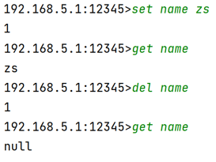
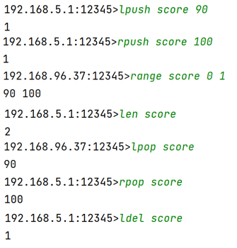
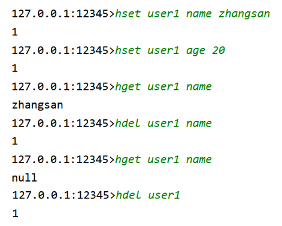
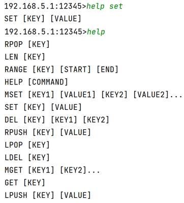
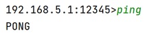

# 2024-backend-recruit-03-Level2

# 目录
- [场景描述](#场景描述)
- [具体要求](#具体要求)
- [示例](#示例)
- [注意](#注意)
- [各个语言可能涉及到的关键特性](#各个语言可能涉及到的关键特性)

### 场景描述

自从父亲的民宿接入"旅馆小帮手"系统后，订单数据就像被哈士奇啃过的账本。张阿姨预定的山景房显示成"后厨洗碗工位"，客人寄存的行李箱在系统里凭空消失。小爪一查代码，发现所有数据都被**胡乱无序地**塞进十几个txt文件里。

而且小爪有时候发现不在家的时候如果也能工作，不就更方便了吗？为此他去了解了网络传输的基本原理，学习**socket**编程技术，成功让自己在外出出差的时候也能够工作。

正巧，小爪还学了一门叫做数据结构的课程。这里讲授了很多种存储结构，他发现了一个神奇的结构----哈希表。它是一种**k-v结构**，其中，key可以用来标识这个数据，value用来存储具体数据。想到这里，小爪很兴奋，他有了更好的想法：既然key可以标识**一个数据**，那也可以用来标识**一组相同类型的数据**；，那再封装一下，不还可以变成**队列**(先进先出)和**栈**(后进先出)吗？

见识到哈希表的灵活与精准，小爪当即决定"用**哈希表**重写！"小爪连夜给每个客人分配唯一ID当key，订单数据用队列存，特色服务用栈存。结果凌晨三点系统突然抽风——301房客人点"叫早服务"时，屏幕弹出刺眼的**NullPointerException**，机器人管家对着空房间喊了半小时"早上好"，把新入住的客人吓到报警。

而且记性不好的他居然将之前学过的**集合框架**都忘了，去哪找可以左进右进，左出右出的数据结构呢？

你能帮小爪设计个防手残的**网络key-value数据库**吗？至少别再让机器人对着空气说"祝您入住愉快"了！

### 具体要求

1. 使用socket编程，手写一个服务端和一个客户端，开启一个服务端后再开启一个客户端，该服务端能对该客户端进行相应的内容响应
2. 使用多线程，使得服务器可以同时对多个客户端进行响应
3. 需要实现的指令
	- 字符串类型（一个key对应一个字符串value）
		- `set [key] [value]` 存储 key-value 类型数据
		- `get [key]`                  获取 key 对应的 value
		- `del [key]`                  删除 key 对应的 value
	- 双向链表类型（一个key对应一个双向链表，即可左右遍历，可以当栈，也可以当队列使用的数据结构）
		- `lpush [key] [value]` 可直接放一个数据在左端
		- `rpush [key] [value]` 可直接放一个数据在右端
		- `range [key] [start] [end]`  将key 对应 start 到 end 位置的数据全部返回
		- `len  [key]`  获取 key 存储数据的个数
		- `lpop [key]`  获取key最左端的数据并删除
		- `rpop [key]`  获取key最右端的数据并删除
		- `ldel [key]`  删除key 所有的数据
	- 其它指令
		- `ping`   心跳指令，ping响应pong
		- `help`   获取所有command指令的使用方式
		- `help [command]`  获取单个command指令适用方式
4. 实现数据持久化，可将产生的`set`与`del`指令写入文件，开启程序时读取
5. 使用配置文件存储监听端口号
6. 高级功能（加分项）
	- 实现日志文件，记录连接程序的ip以及程序运行时异常。
	- 实现文件配置日志、数据持久化文件存储地址等等
	- 拓展指令：哈希类型，一个 key 对应多个 key - value 型数据
		- `hset [key] [field] [value]`存储key对应的键值对数据
		- `hget [key] [field]` 获取key中field字段的value值
		- `hdel [key] [field]` 删除key中field字段及其value值
		- `hdel [key]` 删除key中所有数据

### 示例
> 这里我们以Java为例

- 字符串类型对应`HashMap<String,String>`

- 双向链表类型对应`HashMap<String,LinkedList<String>>`

- 哈希类型对应`HashMap<String,HashMap<String,String>`

- 其它指令
	- `help`

   
	- `ping`

   

### 注意

- 客户端界面不用很美观，有个输入>就好了
	例如：`127.0.0.1:12345>`
- 请先思考好整体架构，注意程序的扩展性，不要盲目开始敲代码。
- 代码注释务必写好。标明每一个方法的作用、变量的作用等等。
- 严禁使用中文拼音或其缩写作为名称！
- 要求分包分类，切勿一个包一个类写到底！！！
- 文件存储可自定义格式存储，配置文件可根据所选语言而定
	- Java可以使用.properties文件，Java中提供了`java.util.Properties`类来读取和解析属性文件
	- 在C/C++中，可以使用第三方库如 `inih` 或 `minIni` 来读取和解析 INI 格式的配置文件
	- Go标准库中的`encoding/json`包提供了用于解析和生成JSON的功能，可以方便地读取和处理JSON格式的配置文件。
- 每个指令都要有相应的响应值，比如说查无指令、不存在key时返回空、修改成功返回1等等，可自定义但必须要见值知意且在说明文档写出。
- 可以利用各个语言的特性来优化项目，提高代码扩展性和简洁性。
- 不同语言中对socket编程与多线程的实现有所不同，难度也有区别，但还是希望遇到遇到困难可以继续坚持，这同时也锻炼了自己解决问题的能力，有任何不清楚的都可以联系师兄师姐。

### 各个语言可能涉及到的关键特性

- Java：I/O流、集合框架、Java异常处理、多线程、Socket编程、字符串处理、日志

- C：Socket编程、I/O、多线程、文件操作、字符串处理

- C++：内存管理、I/O、Socket编程、多线程、STL、字符串处理、日志

- GoLang：输入/输出、并发编程、Goroutine、错误处理、字符串处理、Socket编程、多线程、内存管理、日志
